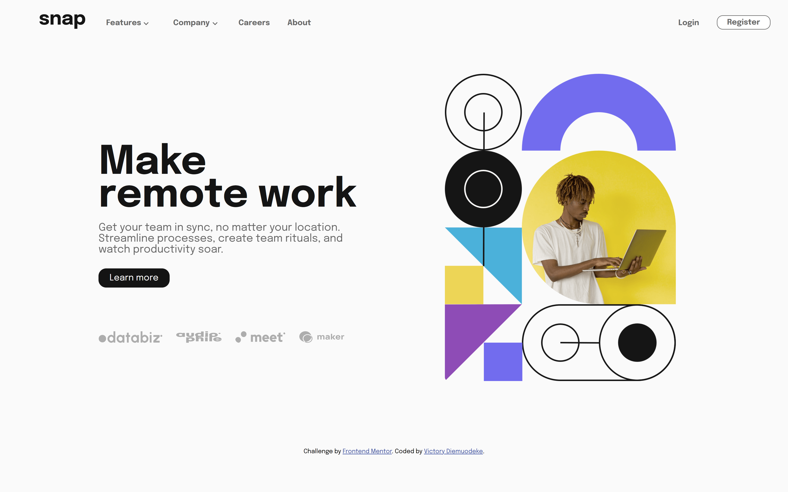

# Frontend Mentor - Intro section with dropdown navigation solution

This is a solution to the [Intro section with dropdown navigation challenge on Frontend Mentor](https://www.frontendmentor.io/challenges/intro-section-with-dropdown-navigation-ryaPetHE5). Frontend Mentor challenges help you improve your coding skills by building realistic projects. 

## Table of contents

- [Overview](#overview)
  - [The challenge](#the-challenge)
  - [Screenshot](#screenshot)
  - [Links](#links)
- [My process](#my-process)
  - [Built with](#built-with)
  - [What I learned](#what-i-learned)
  - [Continued development](#continued-development)
  - [Useful resources](#useful-resources)
- [Author](#author)
- [Acknowledgments](#acknowledgments)

## Overview
This project has been indeed worth the while

### The challenge

Users should be able to:

- View the optimal layout for the site depending on their device's screen size
- See hover states for all interactive elements on the page

### Screenshot




### Links

- Solution URL: [https://www.frontendmentor.io/solutions/responsive-landing-page-using-css-flexbox-aNsVcPptoi]()
- Live Site URL: [https://victoryruro.github.io/intro-section/]()

## My process

### Built with

- Semantic HTML5 markup
- CSS custom properties
- Flexbox
- Mobile-first workflow


### What I learned

Some of my major learning came from pure CSS  especially from the background images positioning, gradient and also the vale -unset- came in handy, then for my JS section , the ternary operator helped a lot and also Array methods like map and also objects.entries pulled through 

```css
.proud-of-this-css {
  position: unset;
}
```
```js
const mapMenu = Object.entries(accordion).map(value =>{
    // console.log(value[1].childNodes.values()); 
    value[1].addEventListener('click', () =>{
        value[1].classList.toggle('active')    
        
    })
     
})
```


### Continued development
For future project I would like to focus on Tailwind CSS and also understanding DOM for JavaScript 


## Author

- Website - [Victory Diemuodeke](https://diemuodeke-victory.netlify.app/)
- Frontend Mentor - [@Victoryruro](https://www.frontendmentor.io/profile/Victoryruro)
- X - [@Vicruro](https://x.com/Vicruro)


## Acknowledgments
I want to specially thank God Almighty for the privilege 


